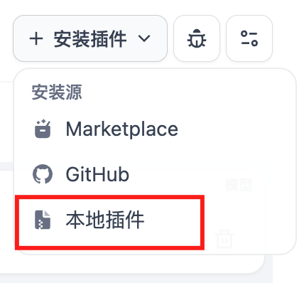
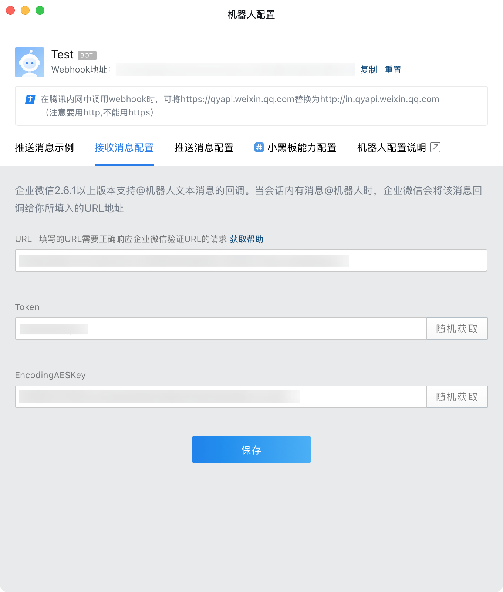
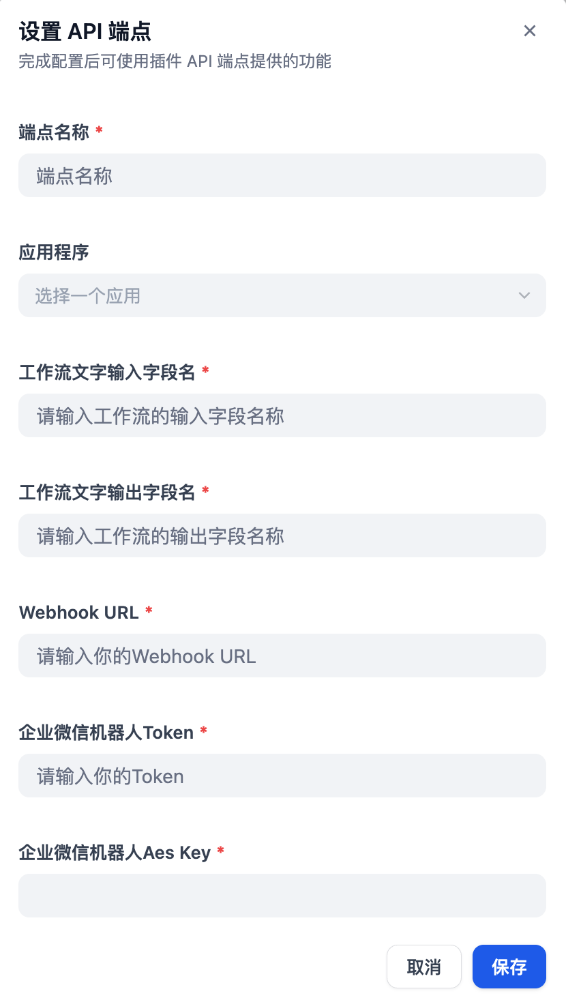
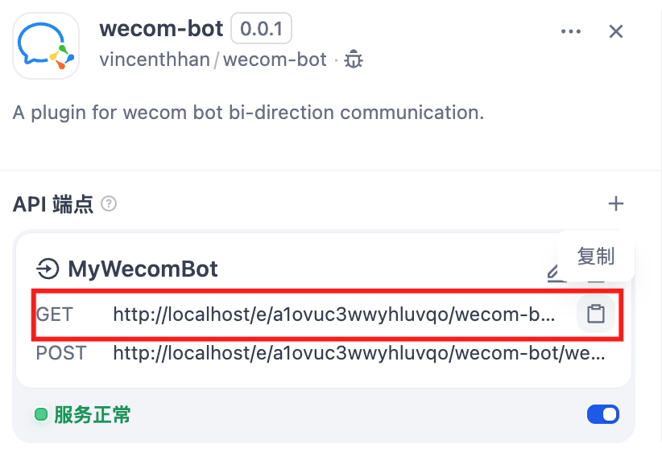

## Wecom Bot
**Author:** vincenthhan
**Version:** 0.0.1
**Type:** extension

## 插件说明

企业微信机器人双向通信插件，适用于Dify 1.0及以上版本，核心功能：

- 通过Dify配置Webhook接收来自企业微信的消息，支持群聊@和单聊的文字内容。
- 调用Dify工作流针对消息进行处理，并通过企业微信机器人的回调接口返回工作流执行结果。

## 安装说明

1. 下载并安装对应版本的插件。安装过程中报错请参考：https://docs.dify.ai/zh-hans/plugins/faq

    

2. 添加企业微信机器人配置，将Webhook、Token、EncodingAESKey分别填入插件配置中的对应位置，并选择对应的工作流。
    - 工作流文字输入字段名：插件将来自企业微信的文字消息作为工作流的输入变量字段。
    - 工作流文字输出字段名：插件将工作流的输出变量字段作为企业微信的回复内容。

    
    

3. 保存插件配置后，插件中会在API端点中出现对应的Endpoint链接，复制**GET**类型的链接填写到企业微信机器人的URL中，保存机器人配置，若成功则说明配置完毕。

    

